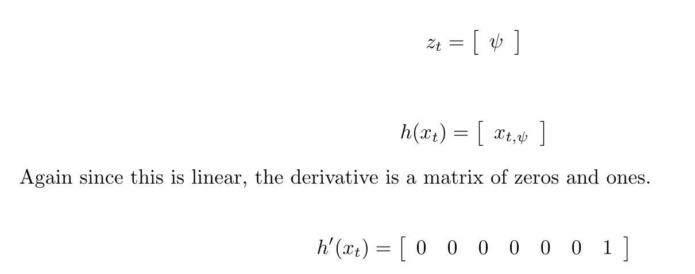

#  Estimation Project README

## Scenario 6
I used Graph1.txt and Graph2.txt to find the standard deviations of .716100583 for the GPS pos and .508607173 for the accelerometer. I then added these to '6_Sensornoise.txt' and came out with the expected ~68% value capture. 

## Scenario 7
I commented out the sample complimentary filter-type attitude code and replaced it with a quaternion representation of the Euler angles and integrated the body rate information given by the gyro. This gave me < 0.1 rad of attitude error.

## Scenario 8
Implemented the predict state function to estimate future vehicle states. This required a change of the frame of reference from that of the body frame to the inertial frame. I then calculated the likely future position given current roll, pitch, yaw, and a prediction time. The resulting estimation values mirrored the actualy track of the vehicle. 

## Scenario 9
Implemented the RBG prime function and used it to generate the prediction of covariance. QPosXYStd and QVelXYStd in 'QuadEstimatorEKF.txt' were then adjusted to contain (but not overcompensate) sensor error over 1 second.

## Scenario 10
Implemented the UpdateFromMag function to lessen the yaw errors and tuned the 'QYawStd' to maintain a standard deviation of less than .1rad.

## Scenario 11
Removed the ideal estimator parameter and watched the drone crash multiple times until the noise values were appropriate for a more realistic model. Then I implemented the UpdateFromGPS and did some further refinement of noise values to get under the 1m goal.

## Scenario 11 Part Deux
Added my controller and control params values from the controls project and watched the drone crash... a lot. After much trial and error, I got consistent behavior under the 1 meter threshold.

